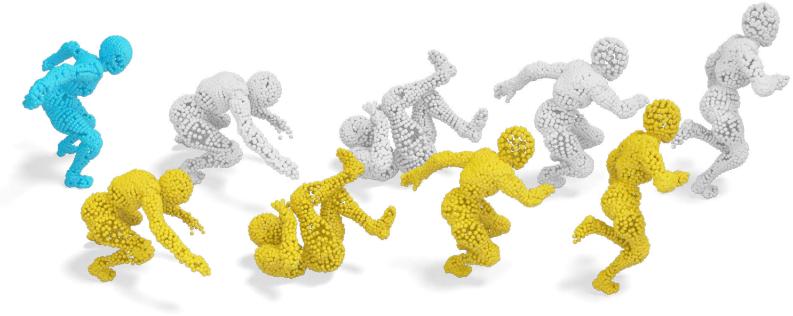

# CVPR24_PointSetReg (Highlight)
<table>
    <tr>
    <td >
 
</td>
    </tr>
</table>
This repository contains the official implementation of our CVPR 2024 paper "Correspondence-Free Nonrigid Point Set Registration Using Unsupervised Clustering Analysis". 

- For convenience, the repository provides both **MATLAB** and **C++** implementations. 
- The MATLAB implementation is extremely **simple**, while C++ implementation is much **faster**.

## MATLAB 
- Step 1: Download the directory **"matlab_code"**, which contains data normalization, registration, and denormalization implementations. 
- Step 2: Start MATLAB and run **"test_demo.m"**. This will give you an immediate registration result for the test point cloud data in the directory **"data"**. 

  

## C++
We are re-implementing the MATLAB code using C++ for better efficiency. We will release it as soon as possible!

## Acknowledgements
This work is partially funded by the Strategic Priority Research Program of the Chinese
Academy of Sciences (XDB0640000), National Science and Technology Major Project (2022ZD0116305), National Natural Science Foundation of China
(62172415,62272277,62376267), and the innoHK project.

