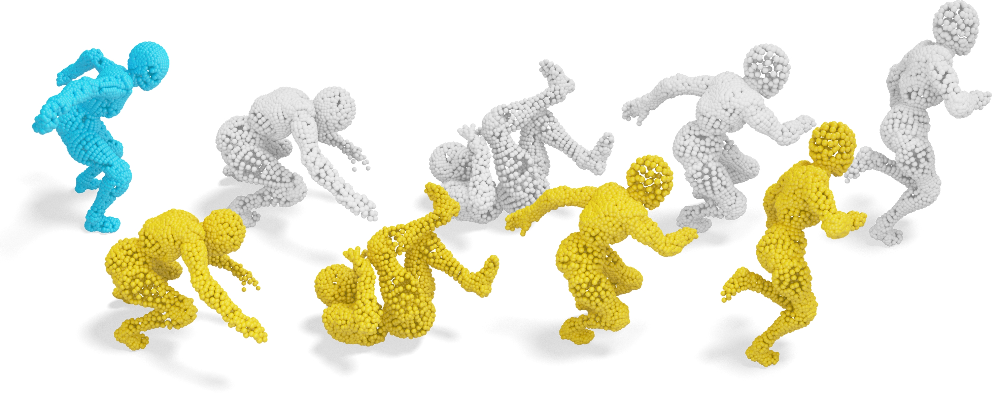

<p align="center">
  <p align="center">
    <h1 align="center">Correspondence-Free Nonrigid Point Set Registration Using Unsupervised Clustering Analysis (CVPR 2024)</h1>
  </p>
  <p align="center" style="font-size:16px">
    <a target="_blank" href="https://zikai1.github.io/"><strong>Mingyang Zhao</strong></a>
    ·
    <a target="_blank" href="https://xiaowuga.github.io/"><strong>Jingen Jiang</strong></a>
    ·
    <a target="_blank" href="https://www.ai.pku.edu.cn/info/1139/1341.htm"><strong>Lei Ma</strong></a>
    ·
    <a target="_blank" href="https://irc.cs.sdu.edu.cn/~shiqing/index.html"><strong>Shiqing Xin</strong></a>
    ·
    <a target="_blank" href="https://scholar.google.com/citations?user=5hti_r0AAAAJ"><strong>Gaofeng Meng</strong></a>
   ·
    <a target="_blank" href="https://sites.google.com/site/yandongming/"><strong>Dong-Ming Yan</strong></a>
  </p>


<!--<font size=15> Correspondence-Free Nonrigid Point Set Registration Using Unsupervised Clustering Analysis (Highlight) <font size=15>-->


### [Project Page](https://zikai1.github.io/pub/CluReg/index.html) | [Paper](https://arxiv.org/abs/2406.18817) | [Poster](https://zikai1.github.io/slides/CVPR24_Creg_poster.pdf)
This repository contains the official implementation of our CVPR 2024 paper "Correspondence-Free Nonrigid Point Set Registration Using Unsupervised Clustering Analysis". 

**Please give a star and cite if you find this repo useful.**

## Motivation
Non-rigid point set registration is to optimize a non-linear displacement field that accurately aligns one geometric shape with another. However, given two point sets, one acting as the source and the other as the target, non-rigid registration presents a highly ill-posed and much more complex challenge compared to the rigid counterpart. This increased complexity is primarily attributed to the additional freedom of deformations allowed in non-rigid registration, especially when dealing with shapes that exhibit large deformations. Previous approaches typically perform shape matching first and then estimate the alignment transformation based on the established correspondences via off-the-shelf registration techniques. Nevertheless, shape matching itself has many outliers that may deteriorate registration. To address this problem, we explore a direct registration method for handling large deformations, without relying on shape matching.

## Implementation
- For convenience, the repository provides both **MATLAB** and **C++** implementations. 
- The MATLAB implementation is extremely **simple**, while C++ implementation is much **faster**.


## MATLAB 
```
- Step 1: Download the directory **"matlab_code"**, which contains data normalization, registration, and denormalization implementations. 
- Step 2: Start MATLAB and run **"test_demo.m"**. This will give you an immediate registration result for the test point cloud data in the directory **"data"**. 
```
  


## C++
### Platform
- Windows 11
- CLion2024.1.2
- Intel(R) Core i9-13900K
- NVIDIA RTX 4090
### Dependence

The dependent libraries of our code includes:
- Eigen3 (3.4.0 or later)
- cli11 (2.4.0 or later), command line.
- Intel-MKL (version 2024.1.0 or later), matrix operation acceleration

Except for Intel-MKL, we recommend using [vcpkg](https://github.com/microsoft/vcpkg) to install dependent libraries.
```shell
# Eigen3
vcpkg install Eigen3:x64-windwos
# cli11
vcpkg install cli11:x64-windows
```
For Intel-MKL, we recommend using the official [installer](https://www.intel.com/content/www/us/en/developer/tools/oneapi/onemkl-download.html) for installation.
```
# Set ${MKL_DIR} in your system/user environment variable
MKL_DIR = ${YOUR_MKL_INSTALL_PATH}/oneAPI/mkl/latest/lib/cmake
# Add following path to your system/user ${Path} environment variable
${YOUR_MKL_INSTALL_PATH}/oneAPI/mkl/latest/bin
${YOUR_MKL_INSTALL_PATH}/oneAPI/compiler/latest/bin
```

### How to build 

Building our code in CLion:
```
# File -> Setting -> Build, Execution, Deployment -> CMake -> CMake Option :
-DCMAKE_TOOLCHAIN_FILE=${YOUR_VCPKG_INSTALL_PATH}/scripts/buildsystems/vcpkg.cmake
```
Making sure that your following settings are correct:
- Toolchains : `Visual Stdio`
- Architecture : `amd64`
- Build Type : `release`

### Usage

The program is run with four input parameters:
```
.CluReg.exe -s <src_path> -t <tar_path> -o <out_path>
```

- `<src_path>`: an input file storing the source point cloud;

- `<tar_path>`: an input file storing the target  point cloud;

- `<out_path>`: an output file storing the path of registered point cloud;


## Contact 
If you have any problem, please contact us via <migyangz@gmail.com> or <xiaowuga@gmail.com>. We greatly appreciate everyone's feedback and insights. Please do not hesitate to get in touch!

### Todo 
A GPU accelerated C++ code version is coming soon !

## Citation
Please consider citing our work if you find it useful:

```bibtex
@inproceedings{zhao2024clustereg,
  title={Correspondence-Free Nonrigid Point Set Registration Using Unsupervised Clustering Analysis},
  author={Mingyang Zhao, Jingen Jiang, Lei Ma, Shiqing Xin, Gaofeng Meng, Dong-Ming Yan},
  booktitle={Proceedings of the IEEE/CVF Conference on Computer Vision and Pattern Recognition},
  year={2024}
}
```

## License
CluReg is under AGPL-3.0, so any downstream solution and products (including cloud services) that include CluReg code inside it should be open-sourced to comply with the AGPL conditions. For learning purposes only and not for commercial use. If you want to use it for commercial purposes, please contact us first.


## Acknowledgements
This work is partially funded by the Strategic Priority Research Program of the Chinese
Academy of Sciences (XDB0640000), National Science and Technology Major Project (2022ZD0116305), National Natural Science Foundation of China
(62172415,62272277,62376267), and the innoHK project.


